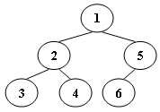

# 1086 Tree Traversals Again
An inorder binary tree traversal can be implemented in a non-recursive way with a stack. For example, suppose that when a 6-node binary tree (with the keys numbered from 1 to 6) is traversed, the stack operations are: push(1); push(2); push(3); pop(); pop(); push(4); pop(); pop(); push(5); push(6); pop(); pop(). Then a unique binary tree (shown in Figure 1) can be generated from this sequence of operations. Your task is to give the postorder traversal sequence of this tree.  

  
Figure 1  

## Input Specification:
Each input file contains one test case. For each case, the first line contains a positive integer N (≤30) which is the total number of nodes in a tree (and hence the nodes are numbered from 1 to N). Then 2N lines follow, each describes a stack operation in the format: "Push X" where X is the index of the node being pushed onto the stack; or "Pop" meaning to pop one node from the stack.

## Output Specification:
For each test case, print the postorder traversal sequence of the corresponding tree in one line. A solution is guaranteed to exist. All the numbers must be separated by exactly one space, and there must be no extra space at the end of the line.

## Sample Input:
    6
    Push 1
    Push 2
    Push 3
    Pop
    Pop
    Push 4
    Pop
    Pop
    Push 5
    Push 6
    Pop
    Pop

## Sample Output:
    3 4 2 6 5 1