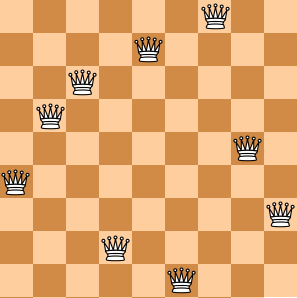

# 1128 N Queens Puzzle
The "eight queens puzzle" is the problem of placing eight chess queens on an 8×8 chessboard so that no two queens threaten each other. Thus, a solution requires that no two queens share the same row, column, or diagonal. The eight queens puzzle is an example of the more general N queens problem of placing N non-attacking queens on an N×N chessboard. (From Wikipedia - "Eight queens puzzle".)

Here you are NOT asked to solve the puzzles. Instead, you are supposed to judge whether or not a given configuration of the chessboard is a solution. To simplify the representation of a chessboard, let us assume that no two queens will be placed in the same column. Then a configuration can be represented by a simple integer sequence (Q1,Q2,⋯,QN), where Qi is the row number of the queen in the i-th column. For example, Figure 1 can be represented by (4, 6, 8, 2, 7, 1, 3, 5) and it is indeed a solution to the 8 queens puzzle; while Figure 2 can be represented by (4, 6, 7, 2, 8, 1, 9, 5, 3) and is NOT a 9 queens' solution.  

		  

## Input Specification:
Each input file contains several test cases. The first line gives an integer K (1<K≤200). Then K lines follow, each gives a configuration in the format "N Q1 Q2 ... QN", where 4≤N≤1000 and it is guaranteed that 1≤Qi≤N for all i=1,⋯,N. The numbers are separated by spaces.

## Output Specification:
For each configuration, if it is a solution to the N queens problem, print YES in a line; or NO if not.

## Sample Input:
    4
    8 4 6 8 2 7 1 3 5
    9 4 6 7 2 8 1 9 5 3
    6 1 5 2 6 4 3
    5 1 3 5 2 4

## Sample Output:
    YES
    NO
    NO
    YES
